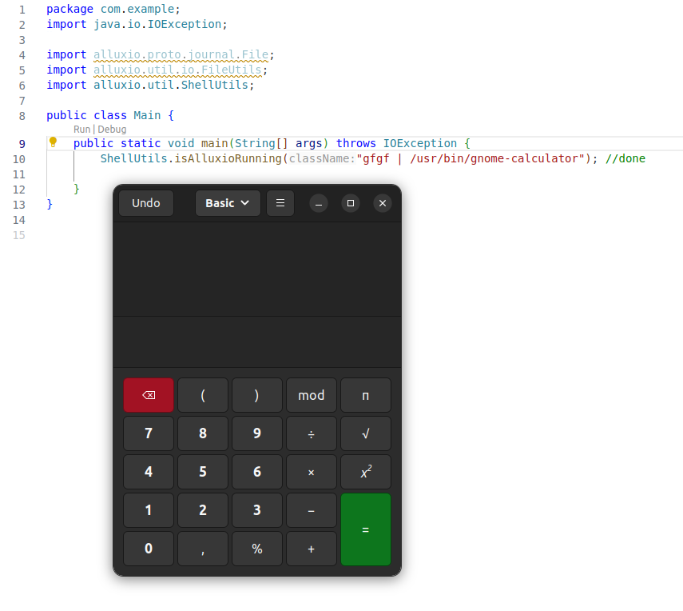

## Воспроизведение
Из корня репы перейти:
```bash
cd alluxio_code_injection_vulnerability/demo2
```

Собрать pom-ник:
```bash
mvn clean install
```

После чего исполнить `Main.java`, который инициирует открытие калькулятора.

---------------------------------
## github issue (report)
https://github.com/Alluxio/alluxio/issues/18595