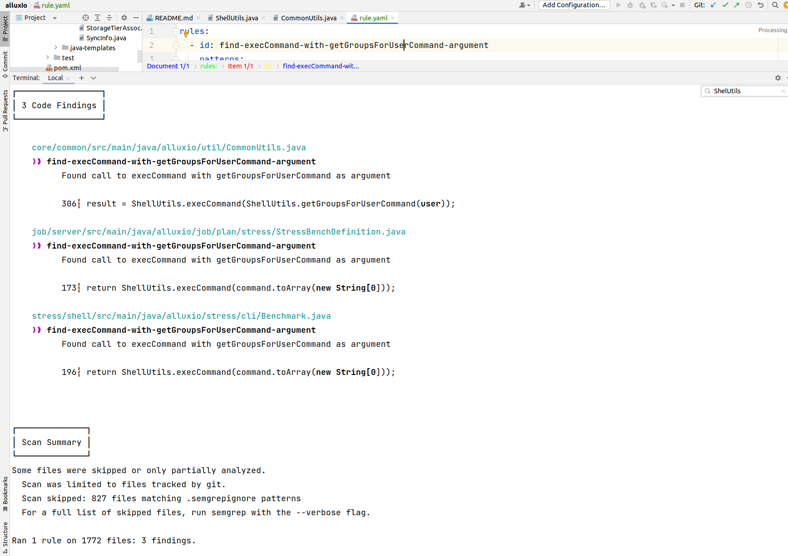

### Правило на Codeql

```
/**
 * @kind path-problem
 */

import java
import semmle.code.java.dataflow.DataFlow
import semmle.code.java.dataflow.TaintTracking 

class PublicMethodParameter extends DataFlow::Node{
    PublicMethodParameter(){
        exists(Method m, Parameter p|
            m.getDeclaringType().isPublic() and 
            m.isPublic() and 
            p = m.getAParameter() and
            p.getType().hasName("String") and
            this.asParameter() = p
            )
    }
}

class ScriptEcho extends DataFlow::Node {
    ScriptEcho() {
        exists(MethodCall ma|
            ma.getCallee().hasName("execCommand") and
            // ma.getCallee().getDeclaringType().getASupertype*().hasQualifiedName("ShellUtils", "String") and
            this.asExpr() = ma.getArgument(0)
            )
    }
}

module MyFlowConfig implements DataFlow::ConfigSig {
    predicate isSource(DataFlow::Node source) {
        source instanceof PublicMethodParameter
    }

    predicate isSink(DataFlow::Node sink) {
        sink instanceof ScriptEcho
    }
}

module MyFlow = TaintTracking::Global<MyFlowConfig>;
import MyFlow::PathGraph

from MyFlow::PathNode source, MyFlow::PathNode sink
where MyFlow::flowPath(source, sink)
select sink.getNode(), source, sink,
    "Source: " + source.getNode().asParameter().getCallable().getDeclaringType() + "." + source.getNode().asParameter().getCallable()
```

Таким образом мы получаем, что у нас в обновленной версии alluxio на месте старого одиночного метода
`result=ShellUtils.execCommand(ShellUtils.getGroupsForUserCommand(user));`
находятся похожие по семантике методы:

Также посмотрев внутрь вызова можем обнаружить то самое возвращение массива string, где раньше было
`return new String[] {"bash", "-c", "id -gn " + user + "; id -Gn " + user};`


Таким образом в предыдущей версии мы могли обратить внимание на то, что возможное исполнение скриптов,
которые мы можем передать в качестве `user`.

### Правило на Semgrep

```
rules:
  - id: find-execCommand-with-getGroupsForUserCommand-argument
    patterns:
      - pattern-inside: |
          $X.execCommand($Y.$METHOD(... ,$Z, ...))
      - focus-metavariable: $Z
    message: "Found call to execCommand with getGroupsForUserCommand as argument"
    severity: WARNING
    languages:
      - java
```

Данное правило показывает нахождения трех функций, удовлетворяющему нашему правилу.


Если залезть внутрь `306┆ result = ShellUtils.execCommand(ShellUtils.getGroupsForUserCommand(user));`, то можно
обнаружить исполнение команды, в которую мы можем передать скрипт.

### Правило на Joern
```bash
val src = cpg.typeDecl.isPublic.method.isPublic.parameter
val sink = cpg.call.name("execCommand").argument
sink.reachableByFlows(src)
```


