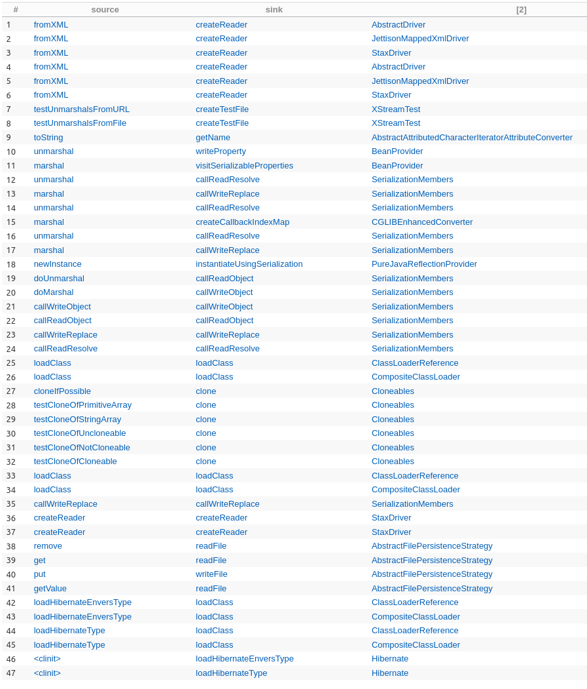
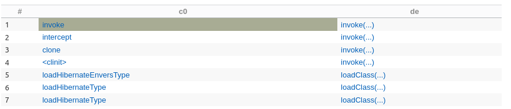
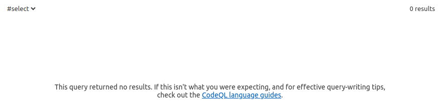

## Исполнение уязвимости

Для исполнения уязвимости из корня hm2 исполнить `XStreamExample.java`

Таким образом получаем переполнение стэка:
```bash
0j47t5z.argfile hm2.XStreamExample 
Exception in thread "main" java.lang.StackOverflowError
        at java.base/java.util.HashMap$KeyIterator.<init>(Unknown Source)
        at java.base/java.util.HashMap$KeySet.iterator(Unknown Source)
        at java.base/java.util.HashSet.iterator(Unknown Source)
        at java.base/java.util.AbstractSet.hashCode(Unknown Source)
        ...
        at java.base/java.util.AbstractSet.hashCode(Unknown Source)
```

`<set reference='../../../set/set[2]'/>:` - указывает на родительский `<set>` элемент в XML-дереве.`../../../set/set[2]`
указывает на второй элемент `<set>` на уровне выше текущего `<set>`. Это создает ссылку на предыдущий уровень 
вложенности, что приводит к рекурсивному поведению.
Когда XStream пытается разобрать этот XML, он начинает рекурсивно обходить структуру данных, но так как каждый 
элемент ссылается на предыдущий, происходит бесконечный цикл, вызывающий переполнение стека.

## Потенциальные векторы атак

По моему мнению с помощью данного переполнения можно класть отдельные ноды датацентров или целиком. Так как можно 
спроектировать кластер атакующих клиентов, чтобы их не забанили за частые запросы. В случае лоадбэленсера или прокси это
все равно не обезопасит от вызовов десериализации xml. Так как будет просто каскадное падение и увелечением нагрузки на
оставшиеся ноды.

## Разбор

В статье указано, то что делается внимание на sink и source, где они будут совпадать. Более того из-за этого возникает 
цепочка и соответственно бесконечная рекурсия. Таким образом принимая во внимание специально созданные классы от 
QLInspector для поиска потенциальных уязвимостей и стандартного запроса из github:

```bash
/**
 * @kind path-problem
 */
import java
import DangerousMethods
import Source


private class DangerousExpression extends Expr {
  DangerousExpression() {
    ( this instanceof Call and this.(Call).getCallee() instanceof DangerousMethod ) or
    ( this instanceof LambdaExpr and this.(LambdaExpr).getExprBody().(MethodAccess).getMethod() instanceof DangerousMethod)
  }
}

private class CallsDangerousMethod extends Callable {
  CallsDangerousMethod(){
    exists(DangerousExpression de | de.getEnclosingCallable() = this)
  }
}

private class RecursiveCallToDangerousMethod extends Callable {
  RecursiveCallToDangerousMethod(){

    not this instanceof Sanitizer and

    /*
    /* can be commented for more results
    */
    (
      getDeclaringType().getASupertype*() instanceof TypeSerializable or
      this.isStatic()
    )

    and

    (
     this instanceof CallsDangerousMethod or
    exists(RecursiveCallToDangerousMethod unsafe | this.polyCalls(unsafe))
    )
  }

    /*
    /* linking a RecursiveCallToDangerousMethod to a DangerousExpression
    */
    DangerousExpression getDangerousExpression(){
    exists(DangerousExpression de | de.getEnclosingCallable() = this and result = de ) or
    exists(RecursiveCallToDangerousMethod unsafe | this.polyCalls(unsafe) and result = unsafe.(RecursiveCallToDangerousMethod).getDangerousExpression())
    }
}


/*
*
* global filter to block function in the chain,
* method names can be added when you found a false positive
*
*/
private class Sanitizer extends Callable {
  Sanitizer(){
    hasName([""])
  }
}


query predicate edges(ControlFlowNode node1, ControlFlowNode node2) {
    (node1.(MethodAccess).getMethod().getAPossibleImplementation() = node2 and node2 instanceof RecursiveCallToDangerousMethod) or
    (node2.(MethodAccess).getEnclosingCallable() = node1 and node1 instanceof RecursiveCallToDangerousMethod)
}

predicate hasCalls(RecursiveCallToDangerousMethod c0, RecursiveCallToDangerousMethod c1) {
    c0.polyCalls(c1) or exists(RecursiveCallToDangerousMethod unsafe | c0.polyCalls(unsafe) and hasCalls(unsafe, c1))
}


from Callable source, Callable sink
where
sink instanceof CallsDangerousMethod
and source.polyCalls(sink)
// and sink.getFile().toString().regexpMatch(".*FeildDeserializer.java")
select  source, sink, sink.getFile()
```

Мы получаем ряд всевозможных потенциальных уязвимостей (ряд из них повторяются)



-------------------------------------------------------------
Если идти по туториулу, то синки:



----------------------------------------------------

Сурсы:



--------------------------------------------------------------------

## Решение
На данный момент нет решения, есть ряд воркэраундов по типу отлавливания ошибки.
