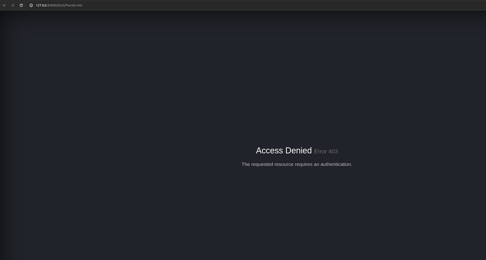
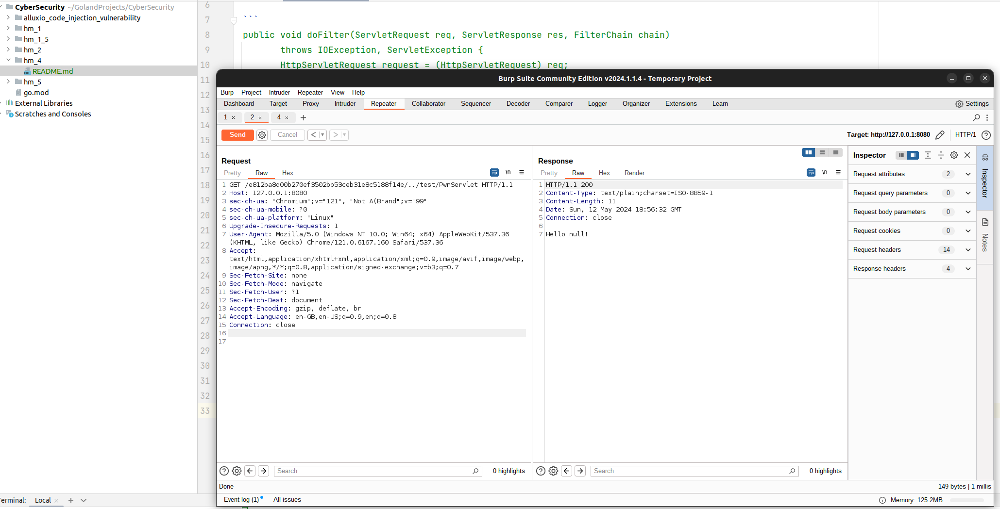
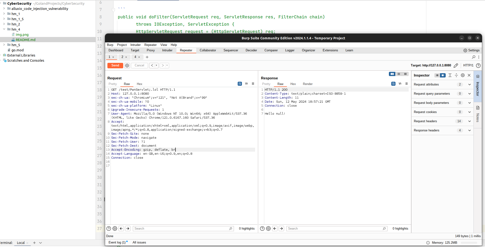
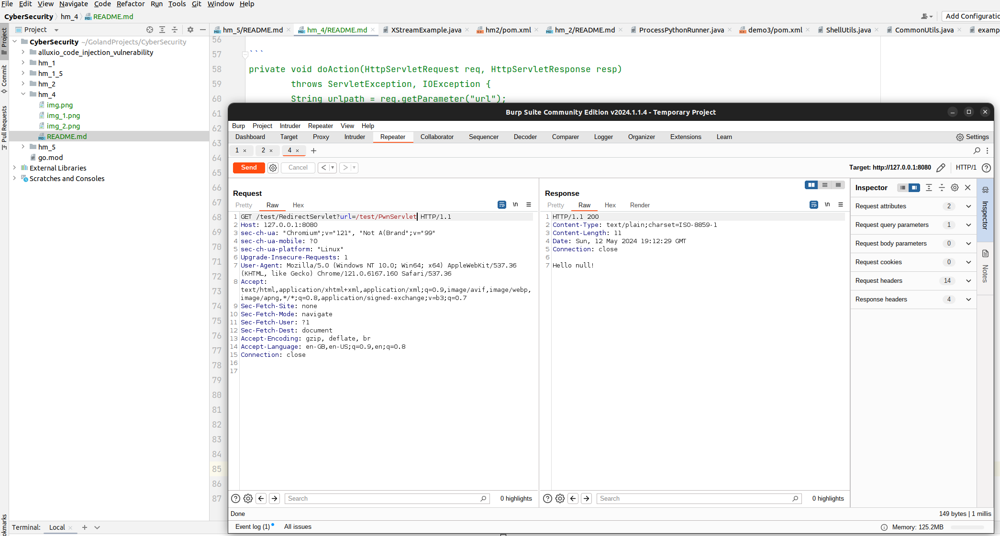
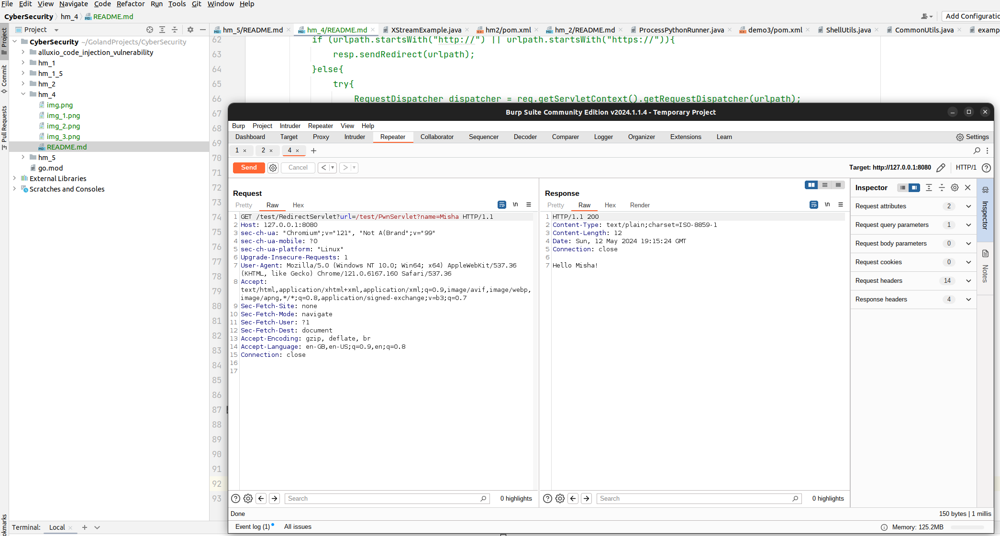

## auth bypass с фильтрами

На сайтах сервлеты используются для обработки HTTP-запросов. Они могут выполнять множество функций, таких как 
обработка данных формы, взаимодействие с базой данных, управление сеансами пользователя и другие.
Рассмотрим код фильтра, который использует следующий сервлет:

 ```
 public void doFilter(ServletRequest req, ServletResponse res, FilterChain chain)
        throws IOException, ServletException {
        HttpServletRequest request = (HttpServletRequest) req;
        HttpServletResponse response = (HttpServletResponse) res;
        System.out.println("PwnServletFilter doFilter() is invoked.");
        String u = request.getRequestURI();
        if (u.startsWith("/e812ba8d00b270ef3502bb53ceb31e8c5188f14e/")){
            chain.doFilter(req, res);
        }else if (u.endsWith(".lol")){
            chain.doFilter(req, res);
        }else{
            response.sendError(403);
        }
    }
 ```

Скрайпим URI из запроса. Далее, достаточно четко и понятно видно, что только в двух случаях происходит проход фильтра:
1. Либо URI начинается с `/e812ba8d00b270ef3502bb53ceb31e8c5188f14e/`;
2. Либо заканчивается на `.lol`.

В противном случае `403` получаем.

Понятно, что это примеры. В реальной жизни могут быть окончание по типу `.js`, `.php` и тд. А начало фильтра можно 
попробовать сгенерировать, для того, чтобы совершить проход. Насколько я понял, такие фильтры делают для каких-то 
дополнительных админских частей функционала сайта.

Демонстрация исправной работы фильтра:



Вот демонстрация прохода фильтра для двух случаев



----------------------------------



-----------------------------------


## auth bypass с помощью forward requests

Теперь же ассмотрим ситуация, когда на различных страницах существуют такие ручки, в параметрах которых есть значение 
`url`, который ссылается например на какую-то картинку, гифку и тд в интернете из открытого доступа. Более того, может 
существовать вариант, когда какие-то файлы лежат локально на сервере или закешированы на проксе например. Поэтому не 
всегда может понадобиться ходить в интернет.

Теперь рассмотрим следующий участок кода:

```
private void doAction(HttpServletRequest req, HttpServletResponse resp)
        throws ServletException, IOException {
        String urlpath = req.getParameter("url");
        if (urlpath != null){
            if (urlpath.startsWith("http://") || urlpath.startsWith("https://")){
                resp.sendRedirect(urlpath);
            }else{
                try{
                    RequestDispatcher dispatcher = req.getServletContext().getRequestDispatcher(urlpath);
                    dispatcher.forward(req, resp);
                }
                catch(Exception e){
                    resp.sendError(404);
                }
            }
        }else{
            resp.setContentType("text/plain");
            resp.getWriter().write("Hello Student!");
        }
    }
```

То есть в данном случае при исполнении запроса скрайпим параметр `url` из ручки.
Если это данные со сторонних сайтов, то проваливаемся в первый `if`. В противном случае, в `else`, форвардимся через 
созданный местный диспатч по заданному параметру из `url`. Тут самое интересное происходит, так как мы потенциально 
можем знать доступную ручку. То с помощью этого знаем заредайректимся по ней без фильтра.

Пример исполнения данного сценария:



Более того, обладая информацией о геттерах и сеттарах возможно передаваемых параметров в ручке и метода get обладающего 
имплементацией `doAction`, можем передать сопутствующие параметры:



Таким образом, успешно миновали фильтр (который изначально не был предусмторен на данном форварде).
