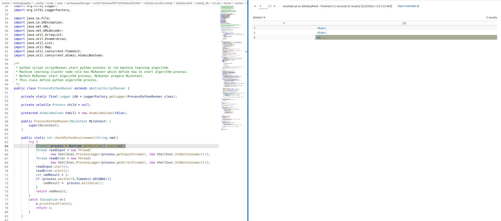
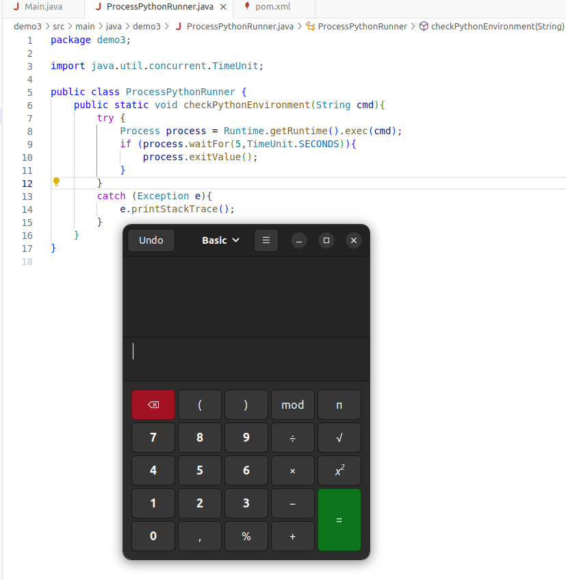

## детектирование
Данная уязвимость была найдена с помощью следующего правила на codeql:
```
import java


class RuntimeExec extends Method {
  RuntimeExec(){
    hasQualifiedName("java.lang", "Runtime", "exec")
  }
}

from MethodCall ma
where ma.getMethod() instanceof RuntimeExec
select ma.getEnclosingStmt()
```


## описание
В методе`com.alibaba.flink.ml.cluster.node.runner.python.ProcessPythonRunner.checkPythonEnvironment(java.lang.String)`
класса `ProcessPythonRunner` присутствует прямое исполнение через `Runtime.getRuntime().exec(java.lang.String)`, где 
идет прямая передача параметра `cmd` в сигнатуру функции без каких либо фильтров. Таким образом, в качестве параметра 
можно передать команду как с припиской оболочки `/bin/sh -c` так и без. Однако не удастся передать несколько команд 
через pipe, так как в таком случае требуется использовать массив из String, однако метод принимает только String.

## воспроизведение
исполнить `Main.java`, который инициирует открытие калькулятора.

## github issue (report)
https://github.com/alibaba/Alink/issues/243

--------------------------------------------------
