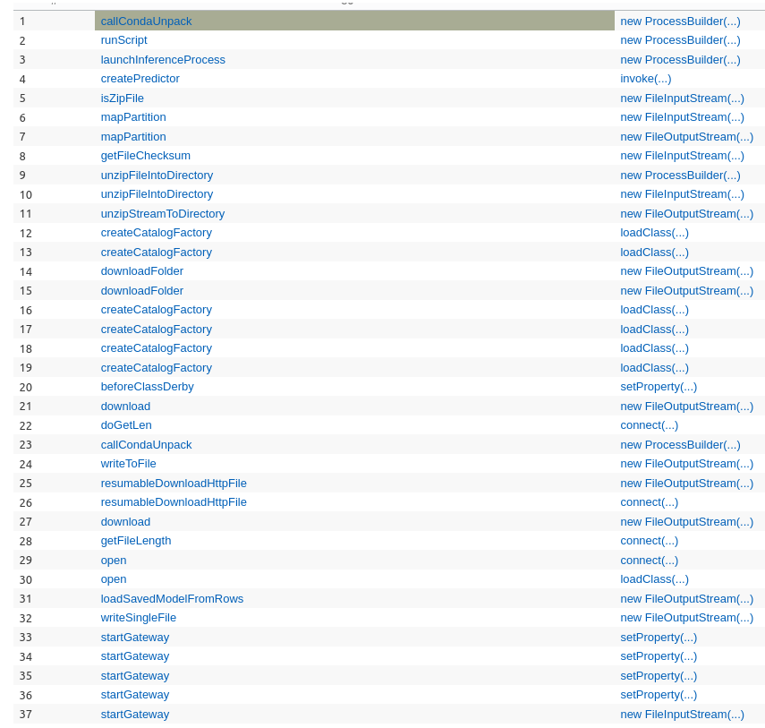
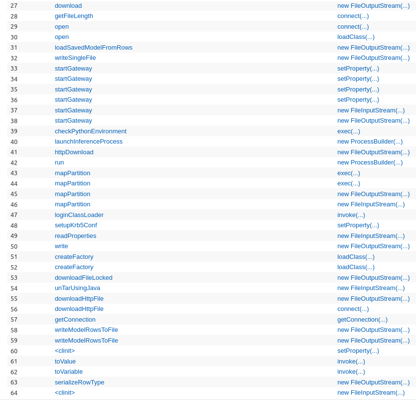
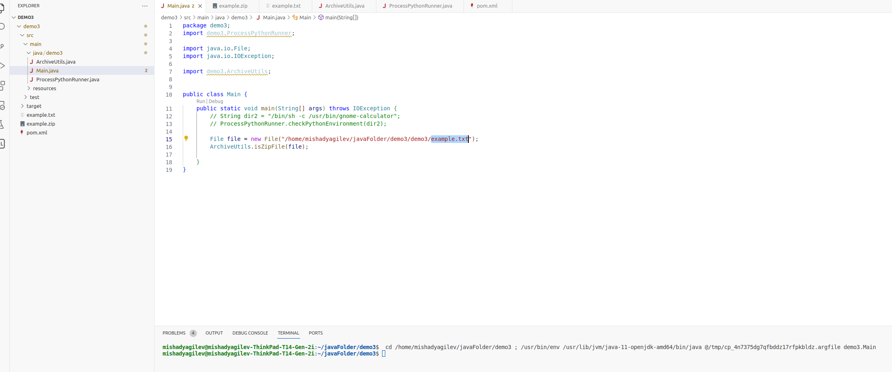

## детектирование
Данная уязвимость была найдена с помощью следующего правила на codeql:
```
import java


class RuntimeExec extends Method {
  RuntimeExec(){
    hasQualifiedName("java.lang", "Runtime", "exec")
  }
}

from MethodCall ma
where ma.getMethod() instanceof RuntimeExec
select ma.getEnclosingStmt()
```


```bash
	public static int checkPythonEnvironment(String cmd){
		try {
			Process process = Runtime.getRuntime().exec(cmd);
			Thread readInput = new Thread(
					new ShellExec.ProcessLogger(process.getInputStream(), new ShellExec.StdOutConsumer()));
			Thread readError = new Thread(
					new ShellExec.ProcessLogger(process.getErrorStream(), new ShellExec.StdOutConsumer()));
			readInput.start();
			readError.start();
			int cmdResult = 1;
			if (process.waitFor(5,TimeUnit.SECONDS)){
				cmdResult =  process.exitValue();
			}
			return cmdResult;
		}
		catch (Exception e){
			e.printStackTrace();
			return 1;
		}
	}
```
--------------------------------

Два других чисто выдают false positives, которые нас не интересуют вообще так как там не прокидываются извне переменные
```bash
DataSet <Object> barrier = output.mapPartition(new MapPartitionFunction <Row, Object>() {
			@Override
			public void mapPartition(Iterable <Row> values, Collector <Object> out) throws Exception {
				LOG.info("killing DL tasks------");
				if (OsType.WINDOWS.equals(OsUtils.getSystemType())) {
					String winStr ="for /f \"skip=1 tokens=1,2 delims=, \" %a in ('tasklist /fi \" " +
							"IMAGENAME eq python.exe\" /FO csv ')  do (  wmic process where processid" +
							"=%b get commandline | findstr startup.py | taskkill /pid %b -f )";
					Runtime.getRuntime().exec(new String[] {"cmd.exe", winStr}, null, null);
				} else {
					String shStr = "ps -ef | grep " + "\"temp_[0-9*]_.*/startup.py\""
							+ " | awk '{print $2}' | xargs kill -9";
					Runtime.getRuntime().exec(new String[] {"/bin/bash", "-c", shStr}, null, null);
				}
			}
		}
```


## описание
В методе`com.alibaba.flink.ml.cluster.node.runner.python.ProcessPythonRunner.checkPythonEnvironment(java.lang.String)`
класса `ProcessPythonRunner` присутствует прямое исполнение через `Runtime.getRuntime().exec(java.lang.String)`, где 
идет прямая передача параметра `cmd` в сигнатуру функции без каких либо фильтров. Таким образом, в качестве параметра 
можно передать команду как с припиской оболочки `/bin/sh -c` так и без. Однако не удастся передать несколько команд 
через pipe, так как в таком случае требуется использовать массив из String, однако метод принимает только String.

## воспроизведение
исполнить `Main.java`, который инициирует открытие калькулятора.

## github issue (report)
https://github.com/alibaba/Alink/issues/243

--------------------------------------------------


## Другое правило
Правила из папки кроме одного ничего не нашли. Поэтому рассмотрим рабочее:
```bash
/**
 * @id synacktiv/java/qlinspector
 * @description find Java gadget chains
 * @name QLInspector
 * @kind path-problem
 * 
 */

 import java
 import DangerousMethods
 import Source
 
 
 /* 
 *
 * Need some improvment with lambda expression,
 * sometimes return unexpected results with lambda expressions
 *
 */
 private class DangerousExpression extends Expr {
   DangerousExpression() {
     ( this instanceof Call and this.(Call).getCallee() instanceof DangerousMethod ) or
     ( this instanceof LambdaExpr and this.(LambdaExpr).getExprBody().(MethodAccess).getMethod() instanceof DangerousMethod)
   }
 }
 
 private class CallsDangerousMethod extends Callable {
   CallsDangerousMethod(){
     exists(DangerousExpression de | de.getEnclosingCallable() = this)
   }
 }
 
 private class RecursiveCallToDangerousMethod extends Callable {
   RecursiveCallToDangerousMethod(){
 
     not this instanceof Sanitizer and
 
     /*
     /* can be commented for more results
     */
     (
       getDeclaringType().getASupertype*() instanceof TypeSerializable or 
       this.isStatic() 
     ) 
     
     and 
     
     (
       this instanceof CallsDangerousMethod or
       exists(RecursiveCallToDangerousMethod unsafe | this.polyCalls(unsafe))
     ) 
   }
 
     /*
     /* linking a RecursiveCallToDangerousMethod to a DangerousExpression
     */
     DangerousExpression getDangerousExpression(){
     exists(DangerousExpression de | de.getEnclosingCallable() = this and result = de ) or 
     exists(RecursiveCallToDangerousMethod unsafe | this.polyCalls(unsafe) and result = unsafe.(RecursiveCallToDangerousMethod).getDangerousExpression())
     }
 }
 
 
 /* 
 *
 * global filter to block function in the chain,
 * method names can be added when you found a false positive
 *
 */
 private class Sanitizer extends Callable {
   Sanitizer(){
     hasName([""]) 
   }
 }
 
 
 query predicate edges(ControlFlowNode node1, ControlFlowNode node2) {
     (node1.(MethodAccess).getMethod().getAPossibleImplementation() = node2 and node2 instanceof RecursiveCallToDangerousMethod) or 
     (node2.(MethodAccess).getEnclosingCallable() = node1 and node1 instanceof RecursiveCallToDangerousMethod)
 }
 
 predicate hasCalls(RecursiveCallToDangerousMethod c0, RecursiveCallToDangerousMethod c1) {
     c0.polyCalls(c1) or exists(RecursiveCallToDangerousMethod unsafe | c0.polyCalls(unsafe) and hasCalls(unsafe, c1))
 }
 
 DangerousExpression findGadgetChain(Callable c0, Callable c1){
   // find chain
   c0 instanceof RecursiveCallToDangerousMethod and
   c1 instanceof RecursiveCallToDangerousMethod and
   exists(DangerousExpression de |  de.getEnclosingCallable() = c1 and 
     hasCalls(c0, c1) and
     result = de
   )
 }
 
 
 // ================ find sink  ================
 from Callable c0,  DangerousExpression de
 where c0 instanceof RecursiveCallToDangerousMethod and
 de.getEnclosingCallable() = c0
 select c0, de

// // ================ find source  ===============
// from Callable c0
// where c0 instanceof RecursiveCallToDangerousMethod and
// c0 instanceof Source
// select c0
```

Которое выкидывают ряд синков (потенциальлных уязвимостей)




Далее я рассмотрел все синки подробно связанные с `FileInputStream()` и `FileOutputStream()`, чтобы откинуть false 
positives. False positives- это те, которые читают или записывают захардкоженные файлы или файлы окружения,
вообщем там где мы не можем никак извне повлиять на функции, используемые `FileInputStream()` и `FileOutputStream()`.

Далее рассмотрим подробно:
1. `com.alibaba.alink.common.dll.utils.ArchivesUtils`

```
public static boolean isZipFile(File file) throws IOException {
		if (file.isDirectory()) {
			return false;
		}
		if (!file.canRead()) {
			throw new IOException("Cannot read file " + file.getAbsolutePath());
		}
		if (file.length() < 4) {
			return false;
		}
		DataInputStream in = new DataInputStream(new BufferedInputStream(new FileInputStream(file)));
		int test = in.readInt();
		in.close();
		return test == 0x504b0304;
	}
```

Нет никаких проверок на то, что файл действительно zip, бесконечная верхняя граница на размерность читаемого файла 
соответственна. Это может позволить злоумышленнику провести атаку на основе переполнения буфера или другие атаки на 
основе ошибок в обработке файлов. Проблема заключается в том, что она открывает и читает файл без проверки его 
содержимого, что может привести к пагубным последствиям.

Собственно демонстрация работы не только на zip архиве



2. ? `com.alibaba.alink.common.dll.utils.DataSetDiskDownloader`

```
static class DownloadFilesMapPartitionFunction
		extends RichMapPartitionFunction <Integer, Tuple2 <Integer, byte[]>> {
		private final List <String> paths;

		public DownloadFilesMapPartitionFunction(List <String> paths) {
			this.paths = paths;
		}

		@Override
		public void mapPartition(Iterable <Integer> values, Collector <Tuple2 <Integer, byte[]>> out)
			throws Exception {
			int taskId = getRuntimeContext().getIndexOfThisSubtask();
			int numTasks = getRuntimeContext().getNumberOfParallelSubtasks();
			if (taskId == 0) {
				String targetDir = PythonFileUtils.createTempDir(String.format("downloaded_files_%s_", taskId)).toString();
				for (String path : paths) {
					if (FileDownloadUtils.isLocalPath(path)) {
						continue;
					}

					String fn = FileDownloadUtils.downloadFileToDirectory(path, new File(targetDir));
					//String fn = PythonFileUtils.getFileName(path);
					//resumableDownloadFileByPieces(path, targetDir, fn);
					File fileOnDisk = new File(targetDir, fn);
					FileInputStream fis = new FileInputStream(fileOnDisk);

					int read;
					final int buffSize = 64 * 1024;    // 64KB
					byte[] buffer = new byte[buffSize];
					while ((read = fis.read(buffer, 0, buffSize)) != -1) {
						if (read > 0) {
							byte[] toSend = new byte[read];
							System.arraycopy(buffer, 0, toSend, 0, read);
							for (int idx = 0; idx < numTasks; idx++) {
								out.collect(Tuple2.of(idx, toSend));
							}
						}
					}
					for (int idx = 0; idx < numTasks; idx++) {
						out.collect(Tuple2.of(idx, new byte[0]));    // flag for end of file
					}
					LOG.info("Downloading on TM with taskId: " + taskId + " ip: " + IpHostUtil.getIpAddress());
					fis.close();
				}
			} else {
				LOG.info("No downloading on TM with taskId: " + taskId + " ip: " + IpHostUtil.getIpAddress());
			}
		}
	}
```

В текущем контексте кода использование `FileInputStream` это открытие потенциально уязвимо для утечки ресурсов. 
В данном коде файлы закрываются корректно `fis.close()` после чтения, что важно для избежания утечек ресурсов. 
Однако, при наличии ошибок при чтении файла или других проблем, которые могут привести к исключениям, поток 
`FileInputStream` может не закрыться корректно, что потенциально может привести к утечке ресурсов.

3. ? `com.alibaba.alink.common.dll.utils.DataSetDiskDownloader`

```
static class ExtractRenameFilesMapPartitionFunction
		extends RichMapPartitionFunction <Tuple2 <Integer, byte[]>, Row> {

		private final List <String> paths;
		private final Map <String, String> renameMap;

		public ExtractRenameFilesMapPartitionFunction(List <String> paths, Map <String, String> renameMap) {
			this.paths = paths;
			this.renameMap = renameMap;
		}

		@Override
		public void mapPartition(Iterable <Tuple2 <Integer, byte[]>> values, Collector <Row> out) throws Exception {
			Iterator <Tuple2 <Integer, byte[]>> iterator = values.iterator();

			int taskId = getRuntimeContext().getIndexOfThisSubtask();
			String targetDir = PythonFileUtils.createTempDir(String.format("work_dir_%s_", taskId)).toString();
			// The order of values are supposed to be unchanged.
			for (String path : paths) {
				boolean isCompressed = PythonFileUtils.isCompressedFile(path);
				String rename = renameMap.get(path);
				String fn = (!isCompressed) && (rename != null)
					? rename
					: PythonFileUtils.getFileName(path);
				File outputFile = new File(targetDir, fn);

				if (FileDownloadUtils.isLocalPath(path)) {
					FileDownloadUtils.downloadFile(path, outputFile);
				} else {
					FileOutputStream fos = new FileOutputStream(outputFile);
					while (iterator.hasNext()) {
						Tuple2 <Integer, byte[]> next = iterator.next();
						byte[] data = next.f1;
						if (data.length > 0) {
							fos.write(data, 0, data.length);
						} else {
							break;
						}
					}
					fos.close();
				}

				if (isCompressed) {
					File decompressedDir = rename != null
						? new File(targetDir, rename)
						: new File(targetDir);
					PythonFileUtils.ensureDirectoryExists(decompressedDir);
					ArchivesUtils.decompressFile(outputFile, decompressedDir);
				}
			}
			Row row = Row.of(targetDir);
			out.collect(row);
		}
	}
```

Потенциальная уязвимость в использовании `FileOutputStream` аналогична предыдущему случаю: если при записи файла 
произойдет ошибка или исключение, поток FileOutputStream может не быть закрыт корректно, что может привести к 
утечке ресурсов.

Чтобы избежать этой проблемы, также можно использовать конструкцию `try-catch`

4. `com.alibaba.alink.common.dll.utils.PythonFileUtils`

```
    static String getFileChecksum(MessageDigest digest, File file) throws IOException {
        //Get file input stream for reading the file content
        FileInputStream fis = new FileInputStream(file);

        //Create byte array to read data in chunks
        byte[] byteArray = new byte[1024];
        int bytesCount = 0;

        //Read file data and update in message digest
        while ((bytesCount = fis.read(byteArray)) != -1) {
            digest.update(byteArray, 0, bytesCount);
        }
        ;

        //close the stream; We don't need it now.
        fis.close();

        //Get the hash's bytes
        byte[] bytes = digest.digest();

        //This bytes[] has bytes in decimal format;
        //Convert it to hexadecimal format
        StringBuilder sb = new StringBuilder();
        for (int i = 0; i < bytes.length; i++) {
            sb.append(Integer.toString((bytes[i] & 0xff) + 0x100, 16).substring(1));
        }

        //return complete hash
        return sb.toString();
    }
```

Тут потенциальная уязвимость, связанная с необходимостью закрытия FileInputStream в случае возникновения исключения 
в процессе чтения файла. Хотя здесь используется конструкция `fis.close()` для закрытия потока, она вызывается только 
после успешного завершения чтения файла. Если возникнет исключение во время чтения файла, поток `FileInputStream` 
останется открытым, и это может привести к утечке ресурсов.

Чтобы избежать этой проблемы, также можно использовать конструкцию `try-catch`

5. `com.alibaba.alink.common.dll.utils.unzipFileIntoDirectory`

```
    public static void unzipFileIntoDirectory(String srcZipFile, String dstDirName) throws IOException, InterruptedException {
        safeMakeDir(dstDirName);
        ProcessBuilder pb = new ProcessBuilder(Arrays.asList(
            "unzip", "-o", "-q",
            new File(srcZipFile).getAbsolutePath(),
            "-d", new File(dstDirName).getAbsolutePath()));
        int code;
        try {
            code = pb.start().waitFor();
        } catch (IOException e) {
            LOG.warn("Failed to use unzip command to decompress file {}, fallback to use Java library.", srcZipFile, e);
            code = 1;
        }
        if (code != 0) {
            unzipStreamToDirectory(new FileInputStream(srcZipFile), dstDirName);
        }
    }
```

Тоже самое: отсутствие проверки формата файла, неявное и необработанное закрытие при плохом чтении.

6. `com.alibaba.alink.common.dll.utils.zipFileUtil`

```
public static void unzipStreamToDirectory(InputStream rawIn, String dstDirName) throws IOException {
        safeMakeDir(dstDirName);
        File dstDir = new File(dstDirName);
        ZipInputStream zin = new ZipInputStream(rawIn);
        ZipEntry ze = zin.getNextEntry();

        while(ze != null) {
            String fileName = ze.getName();
            if (ze.isDirectory()) {
                new File(dstDir.getAbsolutePath() + File.separator + fileName).mkdirs();
            } else {
                File newFile = new File(dstDir.getAbsolutePath() + File.separator + fileName);
                File ppFile = new File(newFile.getParent());
                ppFile.mkdirs();
                FileOutputStream fos = new FileOutputStream(newFile);
                IOUtils.copyLarge(zin, fos);
                IOUtils.closeQuietly(fos);
            }
            ze = zin.getNextEntry();
        }
        zin.closeEntry();
        zin.close();
    }
```

Отсутствие проверки формата данных: поскольку метод принимает `InputStream`, нет гарантий, что переданный поток содержит 
действительный ZIP-архив. Более того скорее всего можно как-то еще применить `../../` при создании файла и распаковать 
не в том месте его. 

7. `com.alibaba.alink.common.io.catalog.HiveBaseUtils`

```
	public static String downloadFolder(FilePath folder, String... files) throws IOException {
		// local
		if (folder.getFileSystem() instanceof LocalFileSystem) {
			return folder.getPathStr();
		}

		File localConfDir = new File(System.getProperty("java.io.tmpdir"), FileUtils.getRandomFilename(""));
		String scheme = folder.getPath().toUri().getScheme();

		if (!localConfDir.mkdir()) {
			throw new RuntimeException("Could not create the dir " + localConfDir.getAbsolutePath());
		}

		if (scheme != null && (scheme.equalsIgnoreCase("http") || scheme.equalsIgnoreCase("https"))) {
			for (String path : files) {
				try (HttpFileSplitReader reader = new HttpFileSplitReader(folder.getPathStr() + "/" + path)) {
					long fileLen = reader.getFileLength();
					reader.open(null, 0, fileLen);

					int offset = 0;
					byte[] buffer = new byte[1024];

					try (FileOutputStream outputStream = new FileOutputStream(
						Paths.get(localConfDir.getPath(), path).toFile())) {
						while (offset < fileLen) {
							int len = reader.read(buffer, offset, 1024);
							outputStream.write(buffer, offset, len);
							offset += len;
						}
					}

				} catch (FileNotFoundException exception) {
					// pass
				}
			}
		} else {
			for (String path : files) {
				// file system
				if (!folder.getFileSystem().exists(new Path(folder.getPath(), path))) {
					continue;
				}

				try (FSDataInputStream inputStream = folder.getFileSystem().open(
					new Path(folder.getPath(), path));
					 FileOutputStream outputStream = new FileOutputStream(
						 Paths.get(localConfDir.getPath(), path).toFile())) {
					IOUtils.copy(inputStream, outputStream);
				}
			}
		}

		return localConfDir.getAbsolutePath();
	}
```

Недостаточная проверка безопасности при работе с HTTP-запросами. Например, отсутствие проверки наличия SSL-сертификатов 
при запросах по протоколу HTTPS или возможность обхода аутентификации. Возможные проблемы с безопасностью при 
копировании файлов из удаленной файловой системы, такие как недостаточная аутентификация или авторизация. Аналогичная 
возможное переполнение в процессе `FileOutputStream`.

8. `shaded_libraries.third_party_flink_ai_extended.flink-ml-framework.src.main.java.com.alibaba.flink.ml.util.HttpUtil`

```
public static boolean httpDownload(String httpUrl, String saveFile) {
		int bytesum = 0;
		int byteread = 0;

		URL url = null;
		try {
			url = new URL(httpUrl);
		} catch (MalformedURLException e1) {
			throw new RuntimeException(e1);
		}

		try {
			URLConnection conn = url.openConnection();
			InputStream inStream = conn.getInputStream();
			FileOutputStream fs = new FileOutputStream(saveFile);

			byte[] buffer = new byte[1024];
			while ((byteread = inStream.read(buffer)) != -1) {
				bytesum += byteread;
				fs.write(buffer, 0, byteread);
			}
			return true;
		} catch (FileNotFoundException e) {
			throw new RuntimeException(e);
		} catch (IOException e) {
			throw new RuntimeException(e);
		}
	}
```

Аналогичная ситуация с переполнением потенциальном. В цикле данные читаются из `InputStream` и записываются в 
локальный файл через `FileOutputStream`. Однако, нет защиты от переполнения буфера. А также нет проверки на размерность 
передаваемого файла, возможно можно использовать какое-то подкидывание файлов на лету. 

9. `com.alibaba.alink.common.dl.utils.DataSetDiskDownloader`

```
public void mapPartition(Iterable <Tuple2 <Integer, byte[]>> values, Collector <Row> out)
					throws Exception {
					int taskId = getRuntimeContext().getIndexOfThisSubtask();
					// write to disk
					Path localPath = Paths.get(targetDir, targetFileName).toAbsolutePath();
					File outputFile = localPath.toFile();
					FileOutputStream fos = new FileOutputStream(outputFile, true);
					for (Tuple2 <Integer, byte[]> val : values) {
						fos.write(val.f1, 0, val.f1.length);
					}
					fos.close();
					LOG.info("Write to disk on TM with taskId: " + taskId + " ip: " + IpHostUtil.getIpAddress());
					Row row = new Row(1);
					row.setField(0, targetDir + File.separator + targetFileName);
					out.collect(row);
				}
```

Аналогично поток `FileOutputStream` не закрывается явно в блоке finally после использования. 
Это может привести к утечке ресурсов или потенциальному переполнению.


10. `com.alibaba.alink.common.dl.utils.DataSetDiskDownloader`

```
public void mapPartition(Iterable <Integer> values, Collector <Tuple2 <Integer, byte[]>> out)
					throws Exception {
					int taskId = getRuntimeContext().getIndexOfThisSubtask();
					int numTasks = getRuntimeContext().getNumberOfParallelSubtasks();
					if (taskId == 0) {
						DownloadUtils.resumableDownloadHttpFile(uri, targetDir, targetFileName);
						// read from local disk and send to other workers
						Path localPath = Paths.get(targetDir, targetFileName).toAbsolutePath();
						File fileOnDisk = localPath.toFile();
						FileInputStream fis = new FileInputStream(fileOnDisk);

						int read;
						final int buffSize = 64 * 1024;    // 64KB
						byte[] buffer = new byte[buffSize];
						while ((read = fis.read(buffer, 0, buffSize)) != -1) {
							byte[] toSend = new byte[read];
							System.arraycopy(buffer, 0, toSend, 0, read);
							for (int idx = 0; idx < numTasks; idx++) {
								out.collect(Tuple2.of(idx, toSend));
							}
						}
						LOG.info("Downloading on TM with taskId: " + taskId + " ip: " + IpHostUtil.getIpAddress());
						fis.close();
						// delete the file.
					} else {
						LOG.info("No downloading on TM with taskId: " + taskId + " ip: " + IpHostUtil.getIpAddress());
					}
				}
```

Аналогичная ситуация `FileInputStream` не закрывается явно.

11. `shaded_libraries.third_party_flink_ai_extended.flink-ml-tensorflow2.src.main.java.com.alibaba.flink.ml.tensorflow2.util.JavaInferenceUtil`

```
	public static Process launchInferenceProcess(MLContext mlContext, RowTypeInfo inRowType, RowTypeInfo outRowType)
			throws IOException {
		...
		args.add(serializeRowType(mlContext, inRowType).toString());
		args.add(serializeRowType(mlContext, outRowType).toString());

		LOG.info("Java Inference Cmd: " + Joiner.on(" ").join(args));
		ProcessBuilder builder = new ProcessBuilder(args);
		builder.redirectOutput(ProcessBuilder.Redirect.INHERIT);
		return builder.start();
	}

	private static URI serializeRowType(MLContext mlContext, RowTypeInfo rowType) throws IOException {
		File file = mlContext.createTempFile("RowType", null);
		try (ObjectOutputStream outputStream = new ObjectOutputStream(new FileOutputStream(file))) {
			outputStream.writeObject(rowType);
		}
		return file.toURI();
	}
```

Скорее всего тут может такде произойти переполнение и потенциальная проблема в сериализации. 

12. `com.alibaba.alink.common.utils.DownloadUtils`

```
private static String downloadHttpFile(String filePath, String dir, String targetFileName) {
		try {
			HttpURLConnection connection;
			URL url = new URL(filePath);
			connection = (HttpURLConnection) url.openConnection();
			connection.setDoInput(true);
			connection.setConnectTimeout(5000);
			connection.setReadTimeout(60000);
			connection.setRequestMethod("GET");
			connection.connect();

			String fn = dir + File.separator + targetFileName;
			//            File file = new File(fn);
			//            file.deleteOnExit();

			int read;
			final int buffSize = 64 * 1024;
			byte[] buffer = new byte[buffSize];
			InputStream in = connection.getInputStream();

			FileOutputStream fos = new FileOutputStream(fn);

			while ((read = in.read(buffer, 0, buffSize)) != -1) {
				fos.write(buffer, 0, read);
			}

			connection.disconnect();
			fos.close();

			return fn;
		} catch (Exception e) {
			e.printStackTrace();
			throw new AkUnclassifiedErrorException("Fail to download file " + filePath);
		}
	}
```


Тут нет проверки на существующий файл перед записью, значит потенциально можно подменить какой-то существующий и 
использовать позже его. Также нет контролирования переполнения при записи.

13. `com.alibaba.alink.common.utils.DownloadUtils`

```
public static String resumableDownloadHttpFile(String remoteFilePath, String dir, String targetFileName) {
		long fileLength = getRemoteFileLength(remoteFilePath);
		if (fileLength == -1) {
			return downloadHttpFile(remoteFilePath, dir, targetFileName);
		}

		Path localPath = Paths.get(dir, targetFileName).toAbsolutePath();
		File outputFile = localPath.toFile();
		URL url;
		try {
			url = new URL(remoteFilePath);
		} catch (MalformedURLException e) {
			throw new AkParseErrorException(String.format("%s is not a valid URL", remoteFilePath), e);
		}

		final int buffSize = 64 * 1024;    // 64KB
		byte[] buffer = new byte[buffSize];

		int maxRetryTimes = 1 << 20;
		int retryCount = 0;
		long existingFileSize = outputFile.length();
		while (existingFileSize < fileLength) {
			retryCount += 1;
			try {
				HttpURLConnection httpConnection = (HttpURLConnection) url.openConnection();
				httpConnection.setRequestProperty(
					"Range",
					String.format("bytes=%d-%d", existingFileSize, fileLength - 1)
				);
				httpConnection.setRequestMethod("GET");
				httpConnection.setConnectTimeout(5000);
				httpConnection.setReadTimeout(60000);
				httpConnection.connect();
				LOG.info("Retry {}: resumable download {} from {} to {}",
					retryCount, remoteFilePath, existingFileSize, fileLength);
				if (AlinkGlobalConfiguration.isPrintProcessInfo()) {
					System.out.println(String.format("Retry %d: resumable download %s from %d to %d",
							retryCount, remoteFilePath, existingFileSize, fileLength));
				}

				InputStream in = httpConnection.getInputStream();
				FileOutputStream fos = new FileOutputStream(outputFile, true);

				int read;
				while ((read = in.read(buffer, 0, buffSize)) != -1) {
					fos.write(buffer, 0, read);
				}
				httpConnection.disconnect();
				fos.close();
			} catch (Exception ex) {
				LOG.info(String.format("Retry %d failed: ", retryCount), ex);
			}
			existingFileSize = outputFile.length();
			if (retryCount > maxRetryTimes) {
				break;
			}
		}
		if (existingFileSize < fileLength) {
			throw new AkUnclassifiedErrorException(
				String.format("Fail to resumable download file with %d tries: %s", retryCount, remoteFilePath));
		}
		return localPath.toString();
	}
```

Тоже вероятное переполнение и утечка при `FileOutputStream`.
